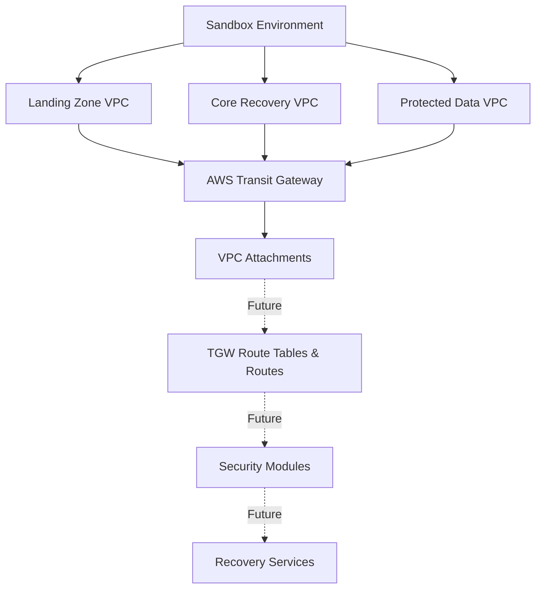

# Sandbox Environment

## Overview

The **Sandbox** environment is the primary development environment for the AWS Isolated Recovery Environment (IRE).

It assembles reusable Terraform modules to provision and validate the networking foundation before deploying security, storage, and recovery services.

---

## Architecture



---

## Deployment Flow

```mermaid
flowchart LR

    Start([terraform apply])

    Start --> VPC["Deploy VPC Modules"]

    VPC --> TGW["Deploy Transit Gateway"]

    TGW --> ATTACH["Create VPC Attachments"]

    ATTACH --> ROUTES["Configure TGW Routing"]

    ROUTES --> SECURITY["Deploy Security Modules"]

    SECURITY --> SERVICES["Deploy Recovery Services"]

    SERVICES --> END([Environment Ready])
```



---

## Module Composition

| Module | Purpose | Status |
|----------|----------|----------------|
| VPC | Landing Zone, Core Recovery and Protected Data VPCs | Completed |
| Transit Gateway | Centralized VPC connectivity | Completed |
| Security Groups | Workload network security | Planned |
| Client VPN | Administrative access | Planned |
| Network Firewall | Traffic inspection | Planned |
| IAM | IAM roles and policies | Planned |
| CloudTrail | Audit logging | Planned |
| GuardDuty | Threat detection | Planned |
| EC2 | Recovery compute | Planned |
| EFS | Shared storage | Planned |
| RDS | Recovery database | Planned |
| S3 Object Lock | Immutable backup storage | Planned |

---

## Directory Structure

```
sandbox/
├── backend.tf
├── locals.tf
├── main.tf
├── outputs.tf
├── providers.tf
├── terraform.tfvars
├── variables.tf
├── versions.tf
└── README.md
```

---

## Network Topology

| VPC | CIDR |
|------|---------------|
| Landing Zone | 10.100.0.0/16 |
| Core Recovery | 10.101.0.0/16 |
| Protected Data | 10.102.0.0/16 |

---

## Deployment Sequence

The Sandbox environment is deployed in the following order.

1. Landing Zone VPC
2. Core Recovery VPC
3. Protected Data VPC
4. AWS Transit Gateway
5. Transit Gateway VPC Attachments
6. Transit Gateway Route Tables
7. Transit Gateway Routes
8. Security Groups
9. Client VPN
10. AWS Managed Microsoft AD
11. AWS Network Firewall
12. Storage Services
13. Recovery Workloads

---

## Deployment

Initialize Terraform.

```bash
terraform init
```

Review the execution plan.

```bash
terraform plan
```

Deploy the environment.

```bash
terraform apply
```

Destroy the environment.

```bash
terraform destroy
```

---

## Deployment Status

| Component | Status |
|------------|----------------|
| Landing Zone VPC | Completed |
| Core Recovery VPC | Completed |
| Protected Data VPC | Completed |
| AWS Transit Gateway | Completed |
| Transit Gateway Attachments | Completed |
| Transit Gateway Route Tables | In Progress |
| Transit Gateway Routes | In Progress |
| Security Services | Planned |
| Recovery Services | Planned |

---

## Design Principles

- Infrastructure is provisioned using reusable Terraform modules.
- Networking components are separated from workload resources.
- Transit Gateway provides centralized connectivity between VPCs.
- Environment-specific configuration is isolated within the `sandbox` directory.
- Modules are designed to be reusable across multiple environments.
- Additional environments (Development, Test, Production) can consume the same modules with different input variables.
