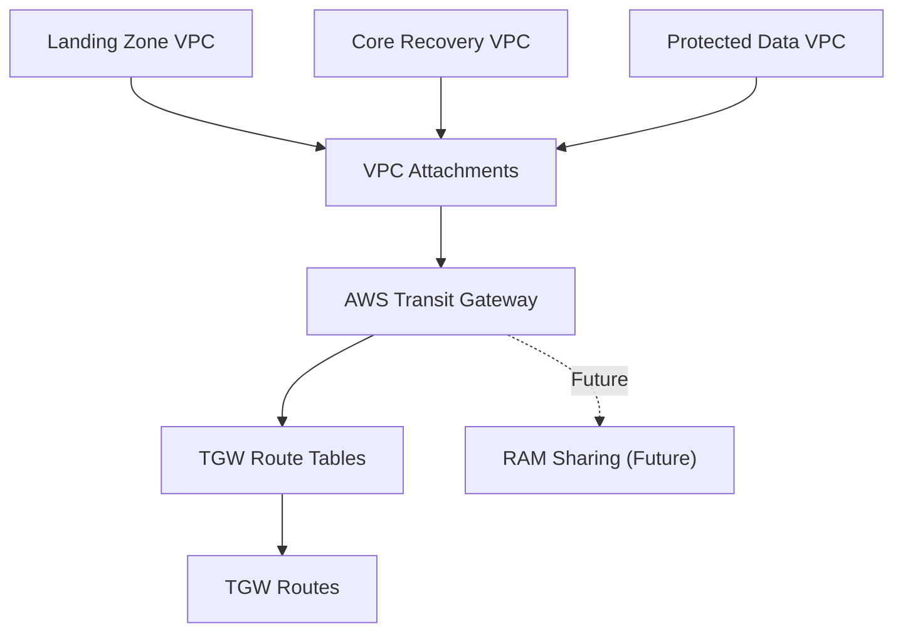

# Transit Gateway Module

## Overview

Creates an AWS Transit Gateway and manages VPC attachments.

This module provides centralized routing between isolated VPCs used within the AWS Isolated Recovery Environment (IRE).

---

## Module Architecture



---

## Current Features

- Transit Gateway
- VPC Attachments
- Enterprise tagging

---

## Example

```hcl
module "transit_gateway" {

  source = "../../modules/transit-gateway"

  vpc_attachments = {

    landing = {
      vpc_id     = module.recovery_access.vpc_id
      subnet_ids = module.recovery_access.private_subnet_ids
    }

    recovery = {
      vpc_id     = module.core_recovery.vpc_id
      subnet_ids = module.core_recovery.private_subnet_ids
    }

    data = {
      vpc_id     = module.protected_data.vpc_id
      subnet_ids = module.protected_data.private_subnet_ids
    }

  }

  tags = local.tags
}
```

---

## Outputs

| Output | Description |
|---------|-------------|
| transit_gateway_id | Transit Gateway ID |
| attachment_ids | VPC Attachment IDs |

---

## Design Decisions

- Single TGW per environment
- Multiple VPC attachments
- Routing managed separately
- No VPC creation inside module
- Reusable across environments

---

## Module Status

| Feature | Status |
|----------|--------|
| Transit Gateway | Complete |
| VPC Attachments | Complete |
| Route Tables | Blocked |
| Routes | Blocked |
| RAM Sharing | Pending |
