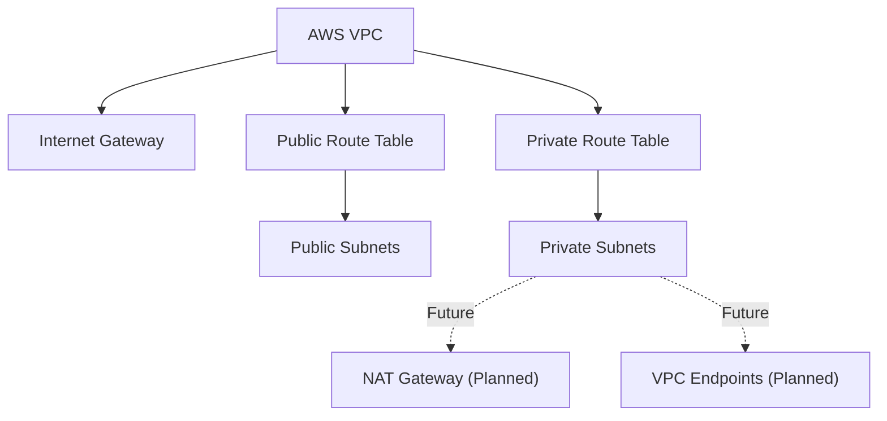

# VPC Module

## Overview

Creates an AWS Virtual Private Cloud (VPC) with configurable public and private subnets.

This module is designed for enterprise environments where networking is managed as reusable infrastructure and instantiated multiple times for different workloads.

Current implementation supports:

- VPC
- Internet Gateway (optional)
- Public Route Table
- Private Route Table
- Public Subnets
- Private Subnets
- Route Table Associations

---

## Architecture

```text
VPC
├── Internet Gateway (optional)
├── Public Route Table
│   └── Public Subnets
└── Private Route Table
    └── Private Subnets
```

## Architecture

## Module Architecture



---

## Repository Usage

Current environments use this module to provision:

| Environment | Purpose |
|-------------|----------|
| Landing Zone | Administrative access |
| Core Recovery | Recovery workloads |
| Protected Data | Backup and recovery storage |

---

## Example

```hcl
module "landing_zone" {

  source = "../../modules/vpc"

  name = "landing-zone"

  cidr = "10.100.0.0/16"

  public_subnets = {
    az1 = "10.100.1.0/24"
    az2 = "10.100.2.0/24"
  }

  private_subnets = {
    az1 = "10.100.101.0/24"
    az2 = "10.100.102.0/24"
  }

  create_internet_gateway = true

  tags = local.tags
}
```

---

## Outputs

| Output | Description |
|---------|-------------|
| vpc_id | VPC ID |
| public_subnet_ids | List of public subnet IDs |
| private_subnet_ids | List of private subnet IDs |
| internet_gateway_id | Internet Gateway ID |
| public_route_table_id | Public Route Table |
| private_route_table_id | Private Route Table |

---

## Design Decisions

- One reusable module for all VPCs
- CIDRs provided by environment
- TGW connectivity handled outside this module
- Security Groups handled separately
- Network Firewall handled separately
- Supports enterprise tagging

---

## Module Status

| Feature | Status |
|----------|--------|
| VPC | Complete |
| Public Subnets | Complete |
| Private Subnets | Complete |
| Route Tables | Complete |
| Internet Gateway | Complete |
| NAT Gateway | WIP |
| VPC Endpoints | WIP |
